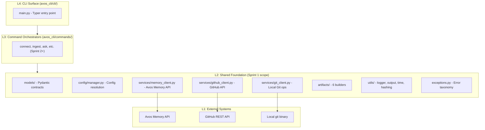
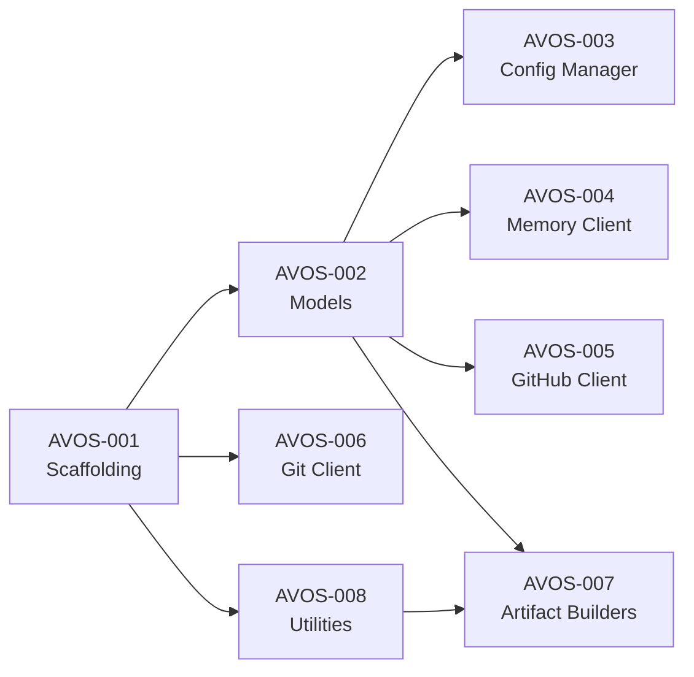

# Sprint 1 Foundation Implementation Plan (AVOS-001 through AVOS-008)

## Current State

The repository is an empty scaffold: directory structure exists with blank `__init__.py` files, empty placeholder modules in `commands/` and `services/`, no `pyproject.toml`, no tests, no CLI entry point, and no implemented logic.

## Architecture Overview



## Dependency and Execution Order



**Phase 1** (sequential): AVOS-001 then AVOS-002
**Phase 2** (parallel after Phase 1): AVOS-003, AVOS-006, AVOS-008
**Phase 3** (parallel after Phase 1): AVOS-004, AVOS-005
**Phase 4** (after Phase 2+3): AVOS-007

---

## Implementation Decisions (Frozen)

Key technology choices from [09-implementation-decisions.md](ai_document/sprint_1/09-implementation-decisions.md):

- **CLI Framework:** Typer
- **Python:** 3.10+, `pyproject.toml` only
- **Linter/Formatter:** Ruff only; **Type checker:** mypy (strict)
- **Models:** Pydantic v2, `T | None = None` union syntax, per-field strictness
- **Config:** JSON only, factory function pattern, mixed env prefix (`AVOS` + standard)
- **HTTP:** httpx, constructor injection, tenacity for retries, parse into Pydantic models
- **Git:** subprocess with mixed parsing (structured + regex fallback)
- **Artifacts:** One class per type with `build()`, SHA-256 hash, JSON sorted keys
- **Utilities:** stdlib logging + custom formatter, Rich for interactive output, stdlib datetime
- **Errors:** Base exception in `avos_cli/exceptions.py`, enum-based error codes
- **Tests:** pytest, respx for HTTP mocking, hybrid directory layout, conftest + factories
- **Docstrings:** Google style, 100% type hint coverage

---

## Step-by-Step Implementation

### AVOS-001: Project Scaffolding and Package Setup

**What:** Create `pyproject.toml`, CLI entry point, quality tooling, Makefile.

**Key files to create/modify:**

- `pyproject.toml` - package metadata, dependencies (typer, pydantic, httpx, tenacity, rich), dev deps (pytest, pytest-cov, pytest-xdist, pytest-timeout, respx, mypy, ruff, freezegun)
- `avos_cli/cli/main.py` - Typer app with `--version` callback
- `avos_cli/__init__.py` - `__version` string
- `avos_cli/exceptions.py` - base exception hierarchy + error codes enum
- `Makefile` - lint, test, format, typecheck commands
- `.gitignore` - add `.avos/`, `__pycache__/`, `.mypy_cache/`, etc.

**Tests:** `tests/unit/test_scaffolding.py` - verify version, CLI entry point, package importability

**Exit gate:** `pip install -e .` works, `avos --version` prints version, `pytest`/`mypy`/`ruff check` all pass

### AVOS-002: Pydantic Data Models

**What:** Define all typed contracts used across the system.

**Key files:**

- `avos_cli/models/config.py` - `RepoConfig`, `SessionState`, `WatchState`, `LLMConfig`
- `avos_cli/models/artifacts.py` - `PRArtifact`, `IssueArtifact`, `CommitArtifact`, `SessionArtifact`, `WIPArtifact`, `DocArtifact`
- `avos_cli/models/api.py` - `SearchRequest`, `SearchResult`, `SearchHit`, `NoteResponse`
- `avos_cli/models/__init__.py` - re-export all public models

**Design notes:**

- `RepoConfig.memory_id` derived deterministically from `repo` field as `repo:{org/repo}`
- `SearchRequest.mode` constrained to `Literal["semantic", "keyword", "hybrid"]`
- `SearchRequest.k` constrained to `ge=1, le=50`
- Sensitive fields (`api_key`, `github_token`) use `SecretStr` from Pydantic
- All models use `model_config = ConfigDict(strict=True)` for security-sensitive fields

**Tests:** `tests/unit/test_models.py` - valid instantiation, invalid rejection with clear errors, serialization round-trip, `SecretStr` behavior

### AVOS-003: Configuration Manager

**What:** Config resolution with env > file > defaults, repo root detection, `.avos` state contract.

**Key files:**

- `avos_cli/config/manager.py` - `load_config()` factory, `save_config()`, `find_repo_root()`
- `avos_cli/config/state.py` - atomic file I/O helpers (temp + fsync + rename), corruption detection/quarantine

**Design notes:**

- `find_repo_root()` walks up from CWD looking for `.git/`
- `load_config()` reads `.avos/config.json`, overlays env vars (`AVOS_API_KEY`, `AVOS_API_URL`, `GITHUB_TOKEN`, `AVOS_DEVELOPER`, `AVOS_LLM_PROVIDER`, `AVOS_LLM_MODEL`), returns `RepoConfig`
- Missing config raises `ConfigurationNotInitializedError` with guidance to run `avos connect`
- Malformed JSON raises `ConfigurationValidationError`
- File writes use atomic temp+fsync+rename pattern
- Restrictive file permissions (0o600) on config files containing secrets

**Tests:** `tests/unit/test_config.py` - precedence resolution, missing config error, malformed JSON, repo root detection edge cases (nested dirs, worktrees). `tests/concurrency/test_config_state.py` - atomic write, corruption quarantine

### AVOS-006: Git Client

**What:** Subprocess wrapper for local git operations.

**Key file:** `avos_cli/services/git_client.py` - `GitClient` class

**Methods:**

- `commit_log(repo_path, since_date) -> list[CommitInfo]`
- `diff_stats(repo_path) -> DiffStats`
- `current_branch(repo_path) -> str`
- `user_name(repo_path) -> str`
- `user_email(repo_path) -> str`
- `remote_origin(repo_path) -> str` (extracts `org/repo`)
- `modified_files(repo_path) -> list[str]`
- `is_worktree(repo_path) -> bool`

**Design notes:**

- Fixed command templates (no shell interpolation)
- All subprocess calls via a private `_run_git()` helper with timeout, stderr capture, and error normalization
- Missing git binary raises `DependencyUnavailableError`
- Non-repo path raises `RepositoryContextError`
- Parse failures raise `ServiceParseError`

**Tests:** `tests/unit/test_git_client.py` and `tests/integration/test_git_fixtures.py` - use `tmp_path` pytest fixture to create real temporary git repos, test commit log parsing, branch detection, worktree scenarios, empty repo, detached HEAD

### AVOS-008: Shared Utilities

**What:** Logging, output formatting, time helpers, content hashing, secret redaction.

**Key files:**

- `avos_cli/utils/logger.py` - structured logging with configurable verbosity, secret redaction filter
- `avos_cli/utils/output.py` - Rich-based terminal output (progress bars, colored status), plain fallback for piped output
- `avos_cli/utils/time_helpers.py` - `days_ago(n)`, `is_within_ttl(timestamp, hours)`, ISO 8601 parse/format
- `avos_cli/utils/hashing.py` - `content_hash(data: str) -> str` using SHA-256 on JSON-normalized input

**Design notes:**

- Redaction filter covers: `api_key`, `token`, `authorization`, `x-api-key`, `secret`, plus regex for `sk`, `ghp\`, `gho\_\` patterns
- Default log level: INFO; DEBUG requires explicit `--verbose` opt-in
- `content_hash()` normalizes via `json.dumps(sorted_keys=True, ensure_ascii=True)` before SHA-256

**Tests:** `tests/unit/test_utils.py` - time edge cases, hash determinism. `tests/security/test_redaction.py` - redaction corpus with representative secret patterns, zero leakage assertion. `tests/determinism/test_hash_stability.py` - repeated hash calls produce identical output

### AVOS-004: Avos Memory Client

**What:** HTTP client for the Avos Memory API (add_memory, search, delete_note).

**Key file:** `avos_cli/services/memory_client.py` - `AvosMemoryClient` class

**API mapping (from [making_user_guide](making_user_guide/)):**

- `add_memory(memory_id, content=None, files=None, media=None, event_at=None) -> NoteResponse`
  - text mode: `POST /api/v1/memories/{memory_id}/notes` (JSON body `{"content": ..., "event_at": ...}`)
  - file mode: `POST /api/v1/memories/{memory_id}/notes/upload` (multipart form)
  - Mutually exclusive modes enforced locally before transport
- `search(memory_id, query, k=5, mode="semantic") -> SearchResult`
  - `POST /api/v1/memories/{memory_id}/search` (JSON body `{"query": ..., "k": ..., "mode": ...}`)
- `delete_note(memory_id, note_id) -> bool`
  - `DELETE /api/v1/memories/{memory_id}/notes/{note_id}` -> True on 204

**Design notes:**

- Auth via `X-API-Key` header; missing key raises `AuthError`
- httpx async client with constructor injection of `api_key` and `api_url`
- Retry via tenacity: max 3 retries, exponential backoff, retry on 429/503/connection errors
- Respect `retry_after` from 429/503 response body
- Timeouts: 30s default, 120s for file uploads
- All responses parsed into Pydantic models
- Secret-safe logging (redact API key in all log output)

**Tests:** `tests/unit/test_memory_client.py` - contract tests with respx mocking for all 3 operations, retry behavior, rate limit handling, auth errors, timeout behavior, mode exclusivity enforcement. `tests/security/test_memory_secret_safety.py` - verify no API key in logs/errors

### AVOS-005: GitHub Client

**What:** GitHub REST API client for fetching PRs, issues, comments, reviews.

**Key file:** `avos_cli/services/github_client.py` - `GitHubClient` class

**Methods:**

- `list_pull_requests(owner, repo, since_date) -> list[PRData]`
- `get_pr_details(owner, repo, pr_number) -> PRDetails`
- `list_issues(owner, repo, since_date) -> list[IssueData]`
- `get_issue_details(owner, repo, issue_number) -> IssueDetails`
- `get_repo_metadata(owner, repo) -> RepoMetadata`
- `validate_repo(owner, repo) -> bool`

**Design notes:**

- Token auth via `Authorization: token {github_token}` header
- Pagination via `Link` header parsing with bounded loop (max 100 pages safety)
- Date window: `since_date` inclusive lower bound (UTC), upper bound exclusive "now"
- Rate limit: parse `X-RateLimit-Remaining` and `X-RateLimit-Reset`, pause when exhausted
- 401/403 -> `AuthError`, 404 -> `ResourceNotFoundError`, rate limit exhaustion -> `RateLimitError`
- httpx sync client, tenacity retry for 5xx errors

**Tests:** `tests/unit/test_github_client.py` - fixture-based contract tests with respx, pagination, date filtering, rate limit handling, auth errors, 404 handling

### AVOS-007: Artifact Builders

**What:** Six builders that transform Pydantic models into structured text for Avos Memory storage.

**Key files:**

- `avos_cli/artifacts/base.py` - `BaseArtifactBuilder` ABC with `build()` and `content_hash()`
- `avos_cli/artifacts/pr_builder.py` - `PRThreadBuilder`
- `avos_cli/artifacts/issue_builder.py` - `IssueBuilder`
- `avos_cli/artifacts/commit_builder.py` - `CommitBuilder`
- `avos_cli/artifacts/doc_builder.py` - `DocBuilder`
- `avos_cli/artifacts/session_builder.py` - `SessionBuilder`
- `avos_cli/artifacts/wip_builder.py` - `WIPBuilder`

**Output format (canonical):**

```
[type: raw_pr_thread]
[repo: org/repo]
[pr: #123]
[author: username]
[merged: 2026-01-15]
[files: path/a.py, path/b.py]
Title: ...
Description: ...
Discussion: ...
```

**Design notes:**

- Metadata keys sorted alphabetically for deterministic hashing
- `content_hash()` uses `avos_cli.utils.hashing.content_hash()` on the built output string
- No sensitive content (raw source code) in any builder output
- Each builder validates its input model before building

**Tests:** `tests/unit/test_artifact_builders.py` - format fidelity per builder, metadata completeness. `tests/determinism/test_artifact_hash.py` - same input produces same hash across 3 runs. `tests/security/test_artifact_content.py` - no sensitive field inclusion

---

## Test Infrastructure

- **Framework:** pytest + pytest-cov + pytest-timeout + pytest-xdist
- **HTTP mocking:** respx (for httpx)
- **Time control:** freezegun
- **Coverage targets:** function >= 95%, branch >= 90%
- **Critical suites:** 3 repeat runs, 0 flake tolerance
- **Fixtures:** `tests/fixtures/` for API response payloads and git output samples
- **conftest.py:** shared fixtures (tmp git repos, mock config, fake clock)

## Execution Discipline

Per your build rules:

1. For each AVOS item: write tests first, then implement, then run tests until green
2. After each component passes, pause for review before proceeding
3. No advancing to next phase until current phase gates are complete
4. Living docs: if logic changes, update documentation immediately
